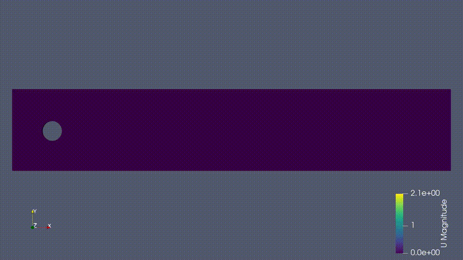

# CFD Portfolio

> **A collection of Computational Fluid Dynamics projects focused on numerical methods, CFD solver development, OpenFOAM development, verification & validation, and scientific computing.**

---

## Portfolio Philosophy

The objective of this portfolio is not simply to perform CFD simulations, but to understand, implement, verify, and extend the numerical algorithms that underpin modern CFD software.

Modern CFD software is built upon numerical methods, mathematical models, and scientific computing. While commercial and open-source packages provide powerful simulation capabilities, understanding the algorithms that govern their behavior is essential for developing reliable and trustworthy CFD solutions.

This portfolio documents my progression from developing CFD solvers from first principles to extending OpenFOAM through custom C++ development. Each project emphasizes understanding the governing equations, numerical methods, software implementation, and rigorous verification rather than treating CFD as a black box.

The portfolio is organized as a progressive learning pathway:

1. Developing CFD solvers from first principles.
2. Investigating numerical discretization methods.
3. Verifying OpenFOAM against benchmark solutions.
4. Developing compressible finite-volume solvers.
5. Extending OpenFOAM through source-code modification.
6. Developing custom OpenFOAM C++ functionality.

Each project builds upon concepts introduced in the previous one, progressing from numerical fundamentals to CFD software development.

---

# Technical Areas

- CFD Solver Development
- Numerical Methods
- Finite Difference Method (FDM)
- Finite Volume Method (FVM)
- OpenFOAM Development (C++)
- Verification & Validation (V&V)
- Python Scientific Computing
- MATLAB Scientific Computing
- High-Performance Computing (HPC)
- Compressible and Incompressible Flows

---

# Projects

---

## 01. Lid-Driven Cavity Solver

A two-dimensional incompressible Navier–Stokes solver developed entirely from scratch using a staggered-grid finite difference formulation. The project implements pressure-velocity coupling using the SIMPLE algorithm and verifies the numerical solution against the benchmark data of Ghia et al.

**Key Skills**

`Finite Difference Method` • `SIMPLE Algorithm` • `Pressure Poisson Solver` • `MATLAB` • `Verification`

---

## 02. Numerical Scheme Comparison

A systematic investigation of first- and second-order convection discretization schemes for incompressible flow. Numerical diffusion, boundedness, and solution accuracy are evaluated through quantitative comparisons to illustrate the numerical accuracy, stability, and numerical diffusion associated with commonly used spatial discretization schemes.

**Key Skills**

`Upwind` • `Central Difference` • `Hybrid Scheme` • `Numerical Accuracy` • `Verification`

---

## 03. Schaefer–Turek Cylinder Benchmark (OpenFOAM)

Reproduction and verification of the classical Schaefer–Turek benchmark using OpenFOAM. Drag coefficient, lift coefficient, vortex shedding frequency, and Strouhal number are extracted and compared with published benchmark data to demonstrate verification against the literature.

**Key Skills**

`OpenFOAM` • `Benchmark Validation` • `Verification & Validation` • `ParaView` • `Python`

---

## 04. Compressible Euler Solver

A one-dimensional finite-volume Euler solver developed from scratch for Sod's shock tube problem. The implementation employs the explicit MacCormack predictor–corrector scheme to capture shocks, contact discontinuities, and expansion waves in compressible flow.

**Key Skills**

`Compressible Flow` • `Finite Volume Method` • `MacCormack Scheme` • `Shock Capturing`

---

## 05. OpenFOAM Source Code Modification

Investigation of OpenFOAM's numerical discretization framework through source-code tracing and modification of TVD flux limiters. The project traces the numerical discretization pipeline from user dictionaries to the underlying C++ implementation, followed by verification through shock-tube simulations using multiple TVD limiter schemes.

**Key Skills**

`OpenFOAM Development` • `C++` • `TVD Schemes` • `Flux Limiters` • `Source Code Analysis`

---

## 06. Custom Transient Swirling Boundary Condition

Development of a custom OpenFOAM C++ boundary condition for prescribing transient swirling inflow. The implementation is verified against analytical velocity profiles and assessed through a systematic grid-convergence study using Richardson extrapolation and the Grid Convergence Index (GCI).

**Key Skills**

`OpenFOAM Development` • `C++` • `Custom Boundary Conditions` • `Verification & Validation` • `Grid Convergence` • `Richardson Extrapolation` • `GCI`

---

# Featured Results

## OpenFOAM Cylinder Benchmark

---

## Compressible Shock Tube Solver

---

## Custom Swirling Boundary Condition

---

## Grid Convergence Study

---

# Repository Structure

For detailed implementation, documentation, verification scripts, and simulation cases, see the individual project directories.

---

# Skills Demonstrated

### Numerical Methods & Verification

- Finite Difference Methods
- Finite Volume Methods
- Pressure-Velocity Coupling
- TVD Flux Limiters
- Shock-Capturing Methods
- Grid Convergence Studies
- Richardson Extrapolation
- Grid Convergence Index (GCI)

### CFD Software Development

- MATLAB
- Python
- C++
- OpenFOAM Development
- Scientific Computing
- Solver Verification
- Boundary Condition Development

### Fluid Mechanics Applications

- Incompressible Flow
- Compressible Flow
- Vortex Shedding
- Swirling Flow
- Shock Tube Problems
- Internal Flows

---

# About Me

I am currently pursuing an **M.S. in Engineering Mechanics** at the **University of Wisconsin–Madison**, with research interests centered on computational fluid dynamics, numerical methods, and scientific computing.

This portfolio reflects my approach to learning CFD: understanding how numerical algorithms are formulated, implemented, verified, and ultimately translated into robust and reliable engineering software.

---

# Future Directions

The next phase of this portfolio will focus on advanced CFD software development, including:

- Turbulence model implementation
- Advanced linear solvers and preconditioning
- Parallel computing and MPI
- Adaptive mesh refinement
- Higher-order finite-volume methods
- Advanced OpenFOAM development

---

**Atharva Gado**

*M.S. Engineering Mechanics (Computational Fluid Dynamics)*

**University of Wisconsin–Madison**