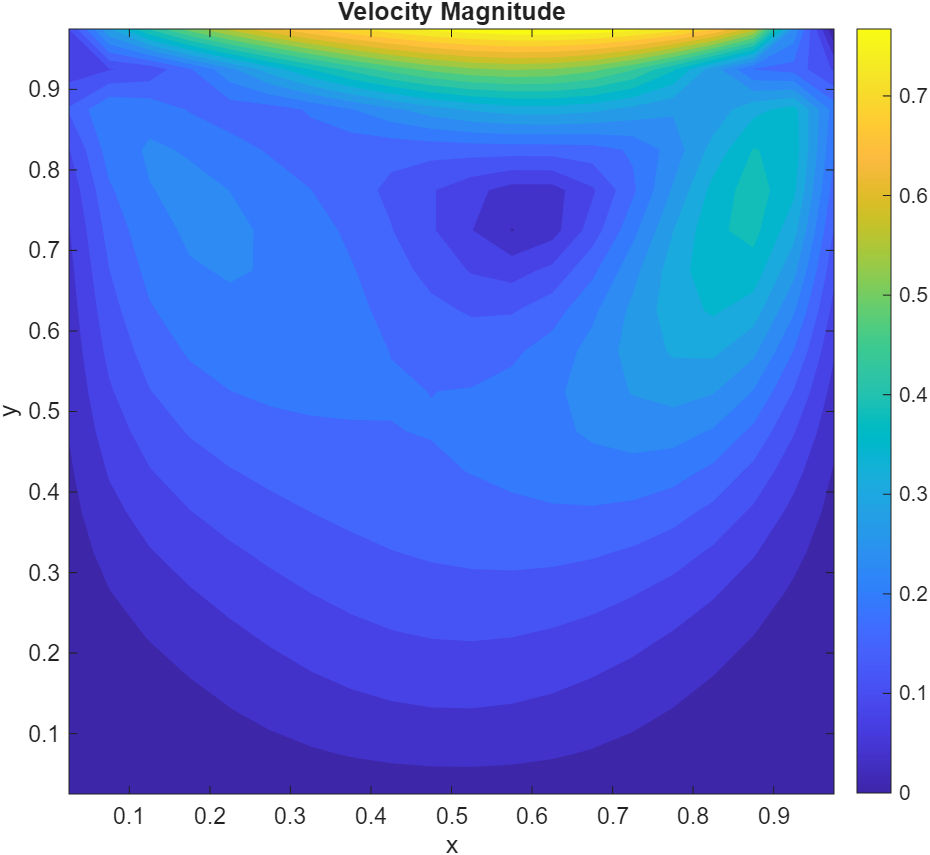
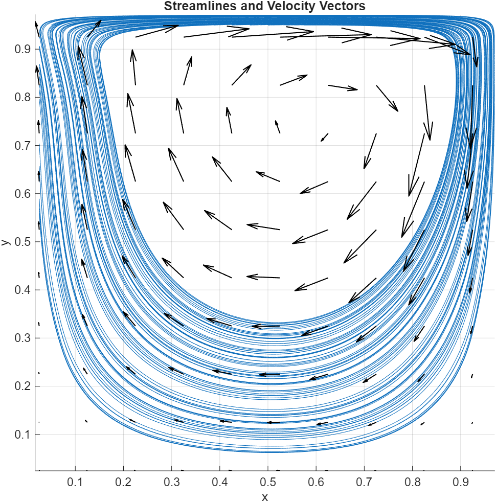
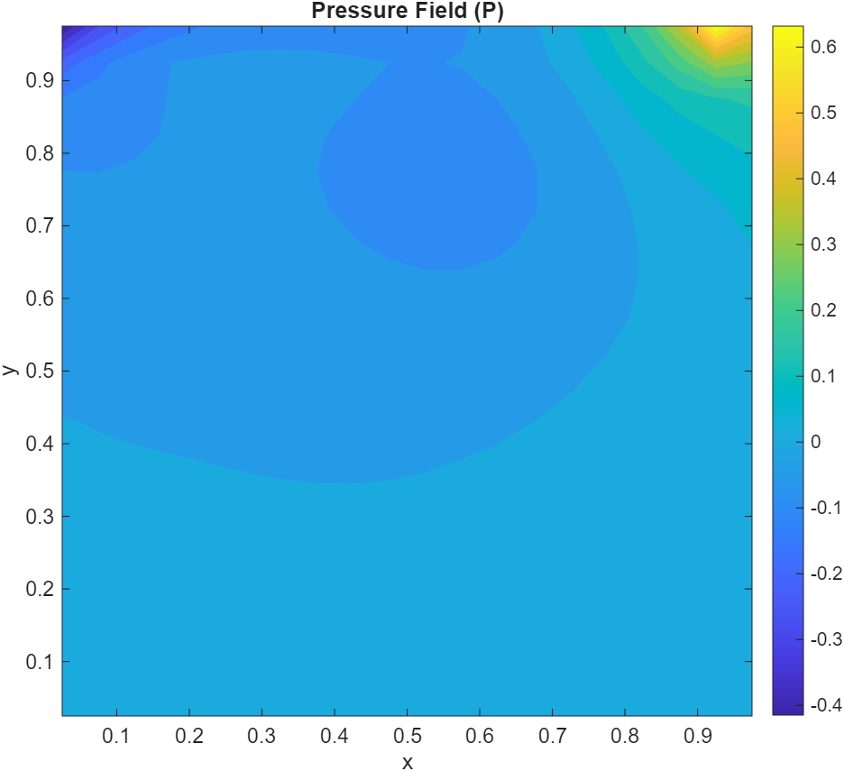
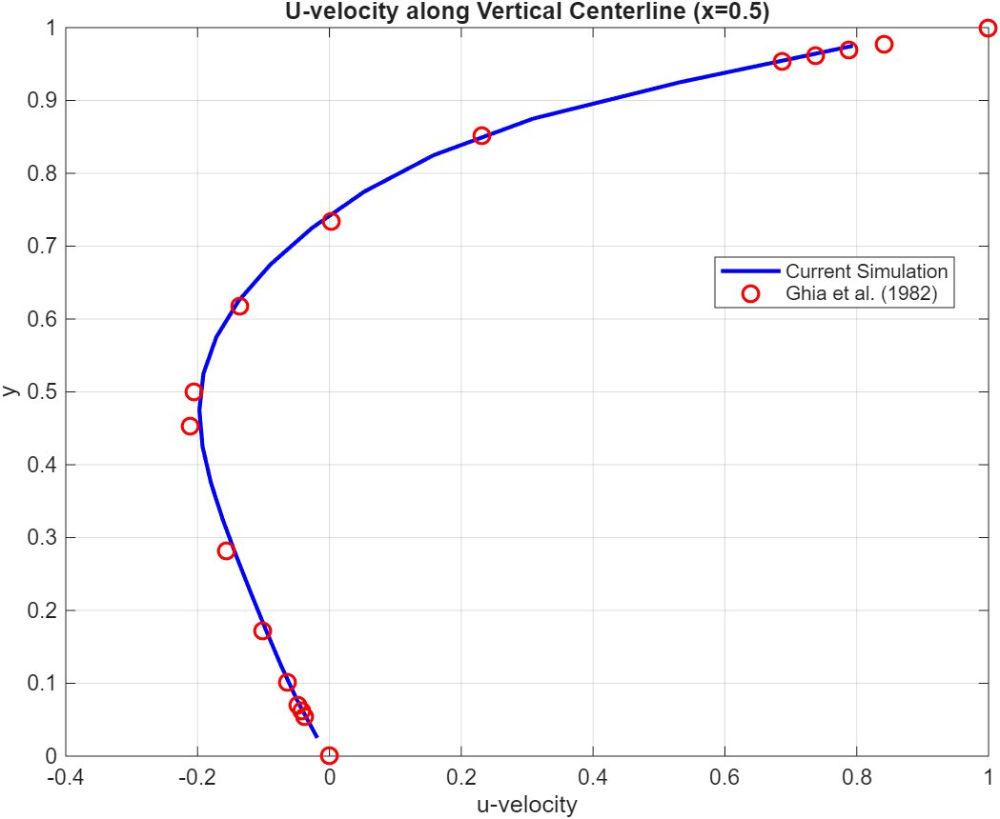
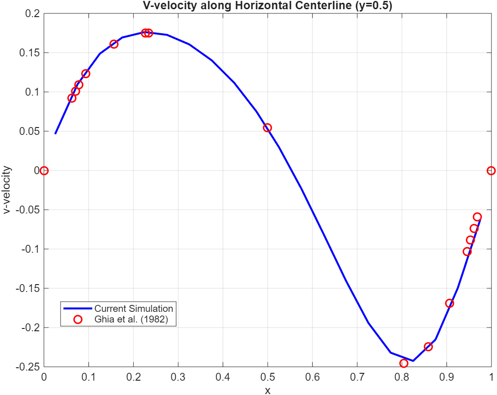
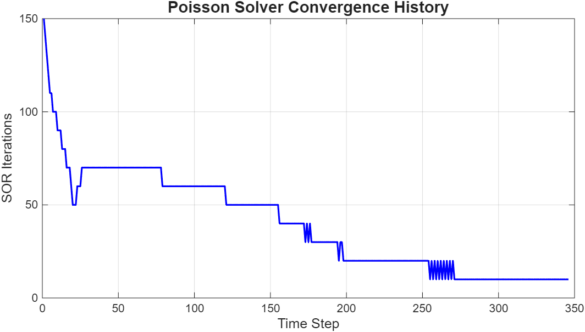

# Lid-Driven Cavity Navier–Stokes Solver

## Objective

This project presents the development of a two-dimensional incompressible Navier–Stokes solver for the classical lid-driven cavity benchmark problem.

The primary objective was to implement the governing equations from first principles and validate the numerical solution against the benchmark data of Ghia et al. (1982).

Simulation conditions:

* Reynolds Number: `Re = 100`
* Domain: Unit Square Cavity
* Lid Velocity: `U = 1`
* Grid Resolution: `40 × 40`

---

## Numerical Method

The solver is developed using:

* Finite Difference Method (FDM)
* Staggered Grid Arrangement
* Explicit Momentum Predictor
* Pressure Poisson Equation (PPE)
* Successive Over-Relaxation (SOR) Pressure Solver
* Projection Method for Incompressibility Enforcement

The staggered-grid formulation prevents pressure checkerboarding and provides stable pressure–velocity coupling.

---

## Validation Reference

The computed centerline velocity profiles are validated against the benchmark results of:

> Ghia, U., Ghia, K. N., & Shin, C. T. (1982)
> *High-Re Solutions for Incompressible Flow Using the Navier–Stokes Equations and a Multigrid Method.*

This benchmark remains one of the most widely used validation cases for incompressible CFD solvers.

---

## Results

### Velocity Magnitude



Velocity magnitude contours showing the primary recirculation zone generated by the moving lid and the characteristic cavity flow structure at Re = 100.

---

### Streamlines and Velocity Vectors



Streamlines and velocity vectors illustrating the dominant clockwise vortex and overall flow topology inside the cavity.

---

### Pressure Contour



Pressure distribution obtained from the pressure Poisson equation, enforcing mass conservation and incompressibility throughout the domain.

---

### U-Centerline Validation



Comparison of the computed vertical centerline velocity profile with benchmark data from Ghia et al.

---

### V-Centerline Validation



Comparison of the computed horizontal centerline velocity profile with benchmark data from Ghia et al.

---

### SOR Convergence History



Convergence history of the Successive Over-Relaxation pressure solver used for the pressure correction step.

---

## Key Outcomes

* Developed a 2D incompressible Navier–Stokes solver from scratch.
* Implemented a staggered-grid formulation for stable pressure–velocity coupling.
* Solved the pressure Poisson equation using SOR iteration.
* Achieved good agreement with benchmark centerline velocity profiles.
* Established a baseline CFD solver framework for future studies involving numerical schemes, turbulence modeling, and advanced flow configurations.

---

## Repository Structure

```text
01-lid-driven-cavity-solver/
├── figures/
│   ├── pressure_contour.png
│   ├── sor_convergence.png
│   ├── streamlines_vectors.png
│   ├── u_centerline_validation.png
│   ├── v_centerline_validation.png
│   └── velocity_magnitude.png
│
├── results/
│
├── src/
│   └── lid_driven_cavity_solver.m
│
└── README.md
```
