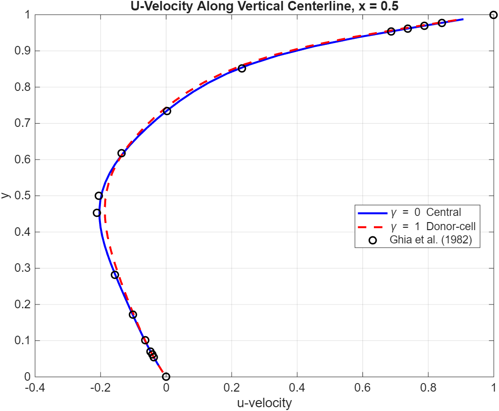
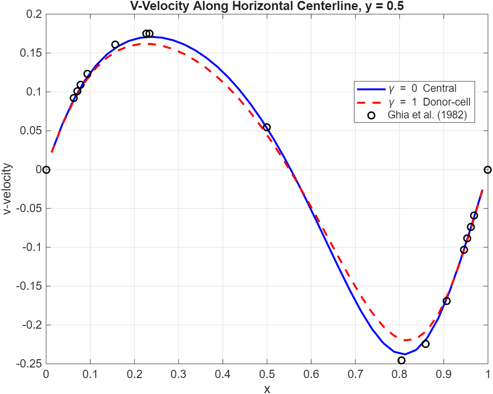
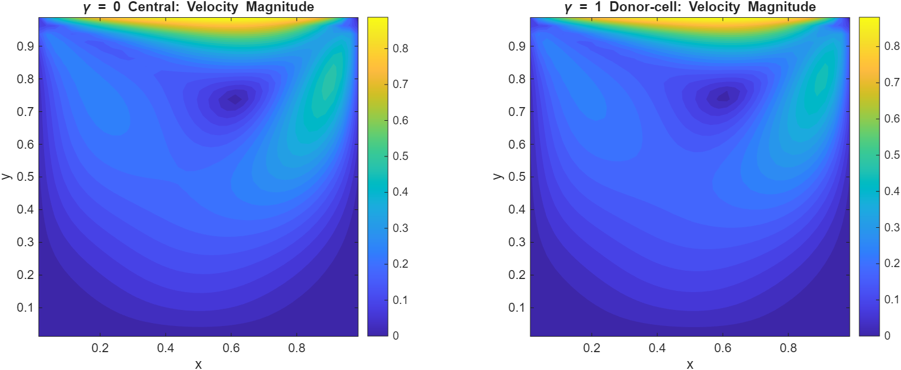
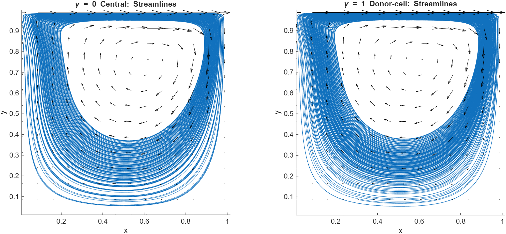
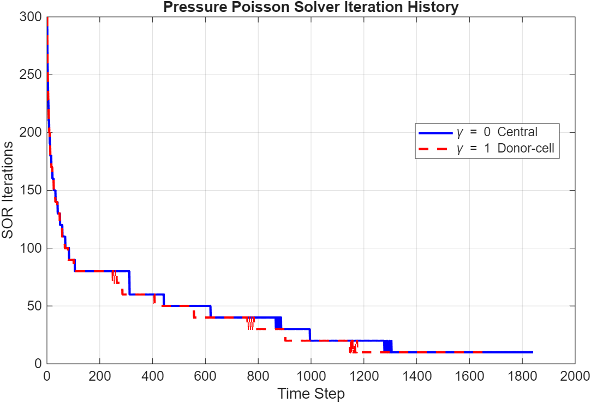
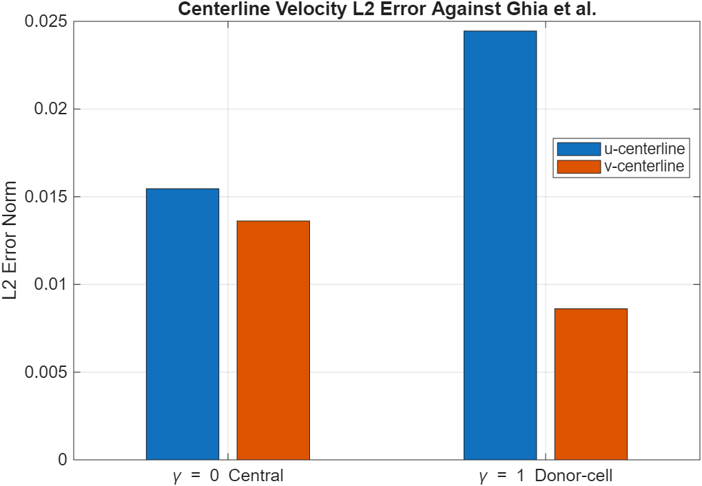

# Numerical Scheme Comparison for Lid-Driven Cavity Flow

## Objective

This project compares the effect of convection discretization schemes on the 2D incompressible Navier–Stokes equations for the lid-driven cavity benchmark problem.

The study compares:

- Central Differencing (`γ = 0`)
- Donor-Cell / Upwind Blending (`γ = 1`)

at `Re = 100` on a `40 × 40` staggered grid.

---

## Numerical Method

The solver uses:

- Finite Difference Method
- Staggered grid arrangement
- Explicit momentum predictor
- Pressure Poisson Equation
- SOR pressure solver
- Projection method for incompressibility enforcement

---

## Validation Reference

The centerline velocity profiles are compared against the benchmark data of Ghia, Ghia, and Shin (1982).

---

## Results

### U-Velocity Centerline Comparison



### V-Velocity Centerline Comparison



### Velocity Magnitude Comparison



### Streamline Comparison



### Pressure Solver Iteration History



### Error Comparison



---

## Quantitative Error Summary

| Scheme | L2(u) | L2(v) | L∞(u) | L∞(v) |
|---|---:|---:|---:|---:|
| γ = 0 Central | 1.5455e-02 | 1.3619e-02 | 5.4917e-02 | 2.7379e-02 |
| γ = 1 Donor-Cell | 2.4450e-02 | 8.6121e-03 | 7.2652e-02 | 2.2570e-02 |

---

## Key Observations

- Central differencing preserves sharper flow structures and gives better agreement for the `u` centerline profile.
- Donor-cell blending introduces numerical diffusion, producing a smoother and more dissipative solution.
- For this grid resolution, the donor-cell scheme gives slightly better agreement for the `v` centerline profile, but this should be interpreted carefully because added numerical diffusion can damp local extrema.
- Both schemes show stable pressure-Poisson convergence behavior, with SOR iterations decreasing as the transient solution approaches steady state.

---

## Repository Structure

```text
02_Numerical_Scheme_Comparison/
├── figures/
├── results/
├── src/
│   └── Numerical_Scheme_Comparison_for_Lid_Driven_Cavity.m
└── README.md
```