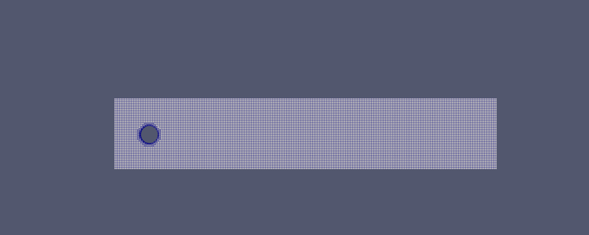
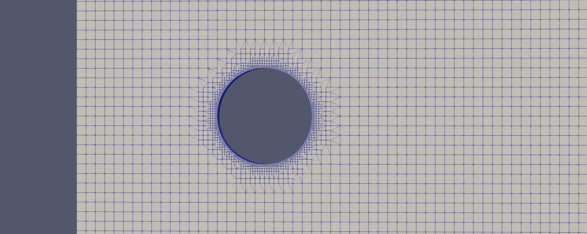
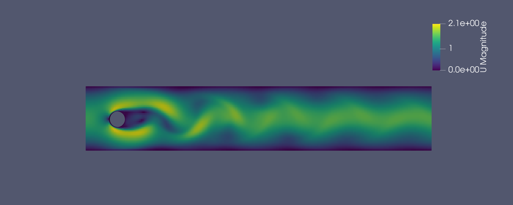
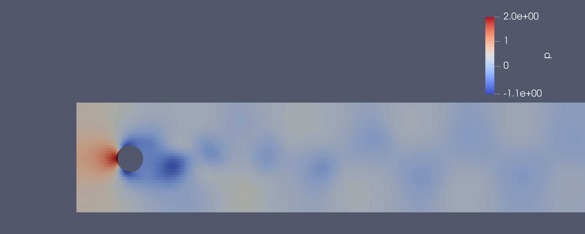
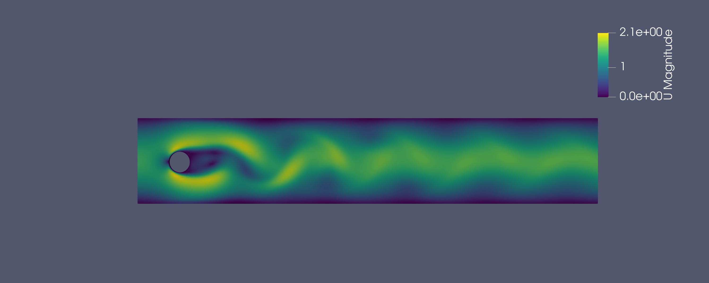
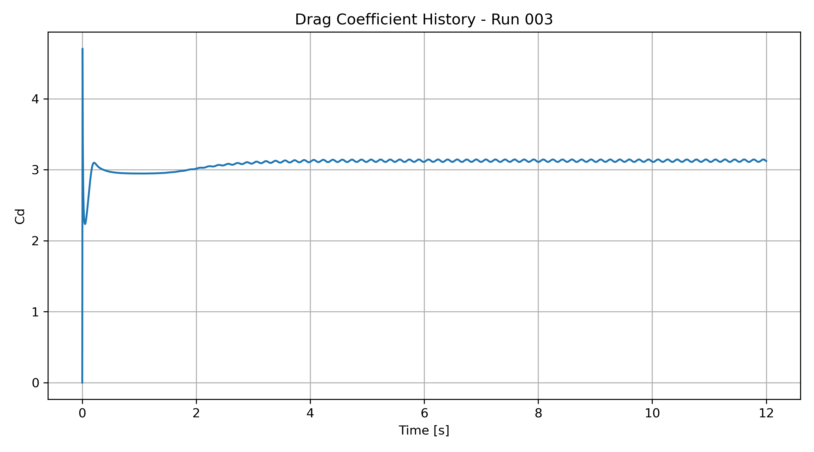
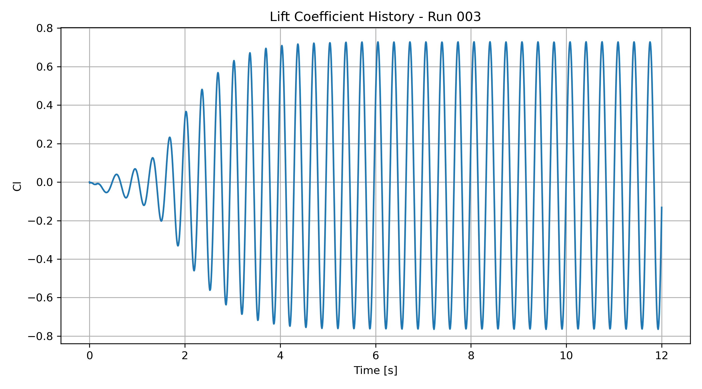
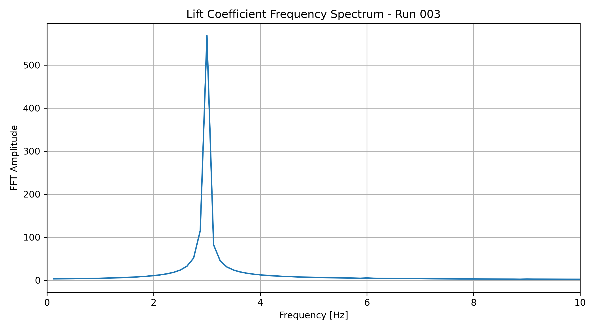

# OpenFOAM Validation: Schäfer–Turek 2D-2 Cylinder Benchmark

## Objective

This project reproduces the Schäfer–Turek 2D-2 benchmark for unsteady incompressible flow past a circular cylinder using OpenFOAM.

The goal is to validate the numerical setup by comparing force coefficients and vortex shedding frequency against published benchmark data, while also documenting the complete workflow from mesh generation to post-processing.

---

## Benchmark Problem

The case consists of laminar flow through a rectangular channel with a circular cylinder placed near the inlet.

| Parameter | Value |
|---|---:|
| Channel length | 2.2 m |
| Channel height | 0.41 m |
| Cylinder diameter | 0.1 m |
| Cylinder center | (0.2, 0.2) m |
| Kinematic viscosity | 1e-3 m²/s |
| Mean inlet velocity | 1.0 m/s |
| Reynolds number | 100 |

The inlet velocity follows a parabolic profile. The resulting flow develops periodic vortex shedding behind the cylinder.

---

## Numerical Method

| Item | Method |
|---|---|
| Solver | `icoFoam` |
| Flow model | Laminar, incompressible, transient |
| Mesh generation | `blockMesh` + `snappyHexMesh` |
| Force extraction | OpenFOAM `forceCoeffs` function object |
| Frequency analysis | FFT of lift coefficient signal |
| Post-processing | ParaView + Python |

---

## Mesh

A structured background mesh was generated using `blockMesh`, followed by local refinement around the cylinder using `snappyHexMesh`.

### Mesh Overview

### Cylinder Refinement

### Mesh Quality

| Quantity | Run 002 | Run 003 |
|---|---:|---:|
| Cells | 10,488 | 15,392 |
| Cylinder boundary faces | 464 | 1,824 |
| Max non-orthogonality | 28.61 | 28.19 |
| Max skewness | 0.686 | 0.688 |

Both meshes passed `checkMesh`.

---

## Flow Visualization

### Velocity Magnitude

### Pressure Contour

### Velocity Gradient Magnitude

The velocity-gradient field highlights the alternating wake structures associated with von Kármán vortex shedding.

---

## Force Coefficient Histories

### Drag Coefficient

### Lift Coefficient

The lift coefficient develops into a periodic oscillation after the initial transient, indicating sustained vortex shedding.

---

## Frequency Analysis

The vortex shedding frequency was obtained using an FFT of the developed portion of the lift coefficient signal.

| Quantity | Value |
|---|---:|
| Dominant shedding frequency | 3.0 Hz |
| Strouhal number | 0.300 |

---

## Validation Summary

| Quantity | Schäfer–Turek 2D-2 Benchmark | Run 003 |
|---|---:|---:|
| Drag coefficient | ~3.22 | 3.13 |
| Lift amplitude | ~0.99 | 0.73 |
| Strouhal number | 0.295–0.305 | 0.300 |

The predicted Strouhal number matches the benchmark range very closely, indicating that the vortex shedding frequency is captured accurately. The drag coefficient is also reasonably close to the benchmark value.

The lift amplitude is underpredicted compared with the benchmark. This is likely due to the current quasi-2D snappyHexMesh setup, lack of dedicated boundary-layer inflation around the cylinder, and limited wake refinement in the practical mesh.

---

## Key Learnings

- Built an OpenFOAM cylinder-flow benchmark case from scratch.
- Generated a circular-cylinder geometry using STL and `snappyHexMesh`.
- Resolved OpenFOAM boundary-condition issues involving `empty`, `patch`, and thin 3D treatment.
- Extracted drag and lift coefficients using `forceCoeffs`.
- Used FFT of lift coefficient history to compute vortex shedding frequency.
- Compared numerical results against a classical CFD benchmark.
- Visualized wake physics using ParaView.

---

## Project Status

This project successfully reproduces the vortex shedding dynamics of the Schäfer–Turek 2D-2 benchmark. The Strouhal number is accurately captured, while lift amplitude remains a known limitation of the current mesh and quasi-2D setup.
