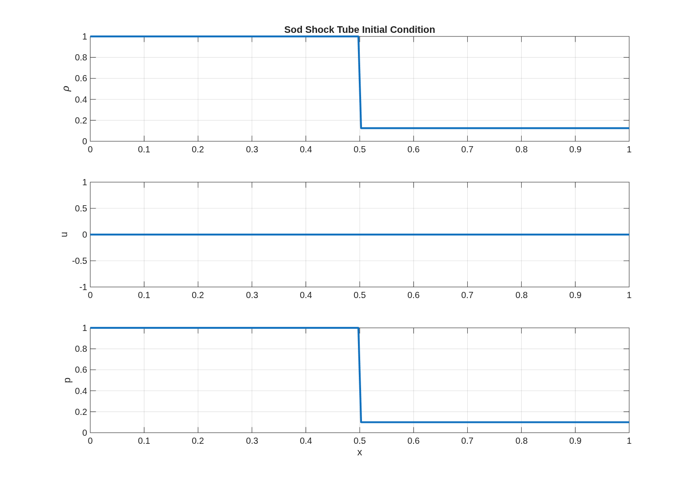
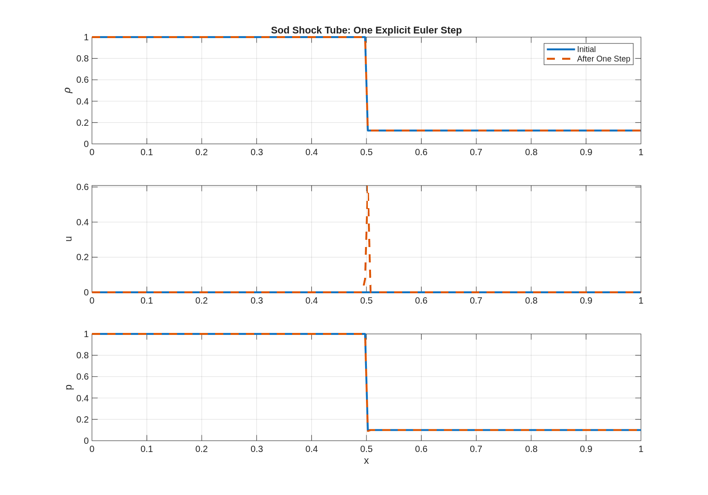
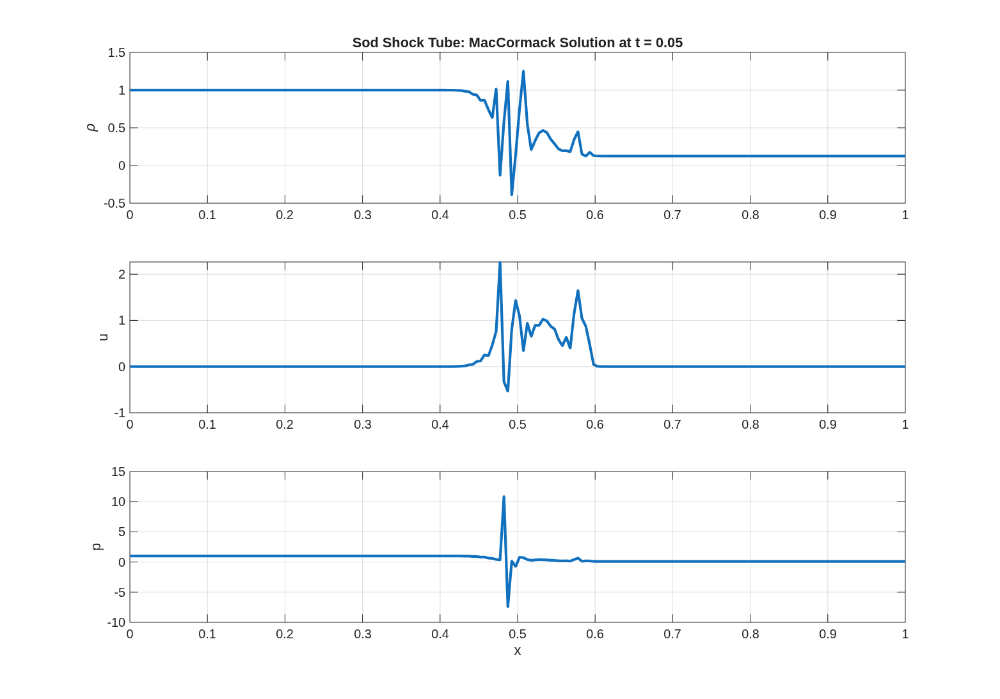
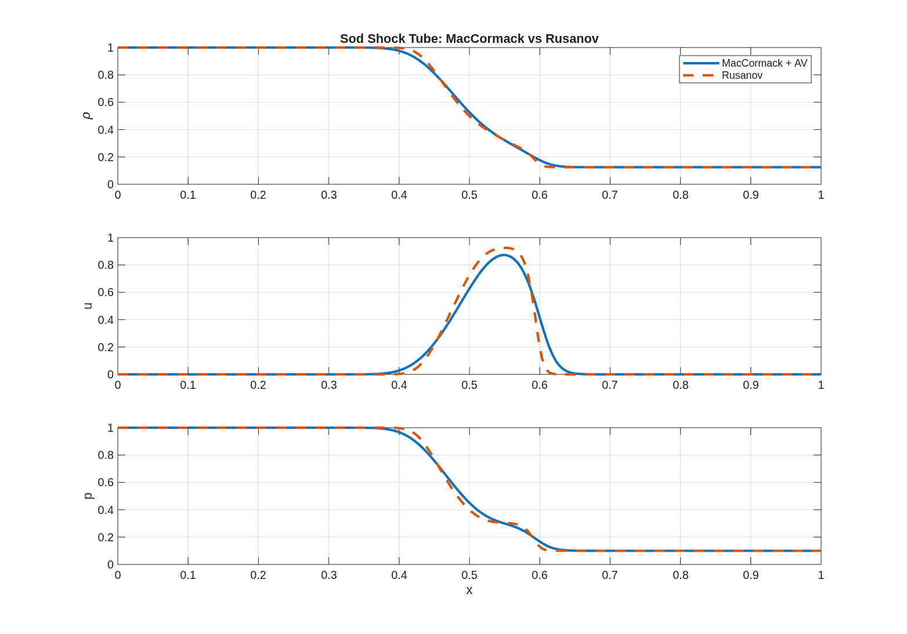
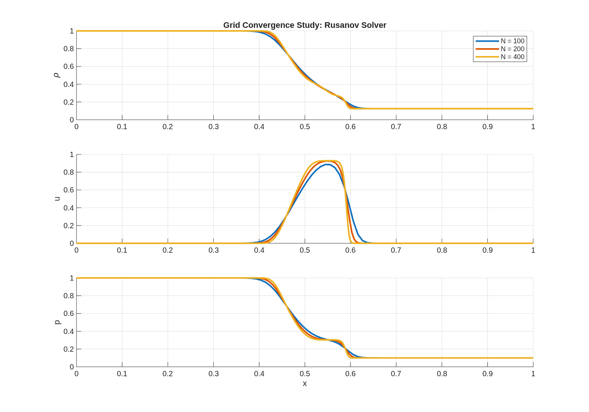

# Project 04: 1D Compressible Euler Solver — Shock Capturing, Scheme Comparison, and Grid Verification

## Overview

This project develops a 1D compressible Euler solver from scratch in MATLAB to investigate numerical methods for shock-dominated flows.

Using the classical Sod shock tube problem, the project explores the complete solver-development workflow: conservative formulations, flux computations, time integration schemes, shock stabilization techniques, finite-volume shock-capturing methods, and solution verification through grid refinement studies.

---

## Numerical Methods Implemented

### Governing Equations

* 1D Compressible Euler Equations
* Conservative Variable Formulation

### Core Solver Components

* Primitive ↔ Conserved Variable Conversion
* Euler Flux Computation
* CFL-Based Adaptive Time Stepping
* Flux Gradient Evaluation

### Time Integration Schemes

* Explicit Euler Update (Diagnostic)
* MacCormack Predictor-Corrector Scheme
* Artificial Viscosity Stabilization

### Shock-Capturing Method

* Rusanov (Local Lax-Friedrichs) Flux Solver

---

## Test Case: Sod Shock Tube

Initial conditions:

| Region | Density | Velocity | Pressure |
| ------ | ------- | -------- | -------- |
| Left   | 1.0     | 0.0      | 1.0      |
| Right  | 0.125   | 0.0      | 0.1      |

The Sod shock tube provides a canonical benchmark for compressible flow solvers and contains a rarefaction wave, contact discontinuity, and shock wave.

---

## Key Findings

### MacCormack Scheme

The raw MacCormack scheme produced oscillations near the discontinuity, resulting in nonphysical pressure and density behavior.

### Artificial Viscosity

Artificial viscosity successfully stabilized the solution but introduced additional numerical diffusion.

### Rusanov Flux

The Rusanov solver provided a more robust shock-capturing formulation based on interface fluxes and characteristic wave speeds.

---

## Results

### Sod Shock Tube Initial Condition

### One-Step Euler Diagnostic

### Stabilized MacCormack Solution

### MacCormack vs Rusanov Comparison

---

## Verification: Grid Convergence Study

A grid refinement study was performed using the Rusanov flux solver with:

* N = 100
* N = 200
* N = 400

The results demonstrate convergence of density, velocity, and pressure profiles with mesh refinement and reduced numerical diffusion at higher resolutions.

---

## Lessons Learned

This project highlighted several important concepts in compressible CFD:

* Stability limitations of higher-order schemes near discontinuities
* The tradeoff between numerical stability and numerical diffusion
* The role of interface fluxes in finite-volume shock-capturing methods
* The importance of verification through grid refinement studies

---

## Future Improvements

- Exact Sod/Riemann solution comparison
- L1 and L2 error norm analysis
- Roe flux implementation
- HLL and HLLC approximate Riemann solvers
- Quasi-1D nozzle flow solver
