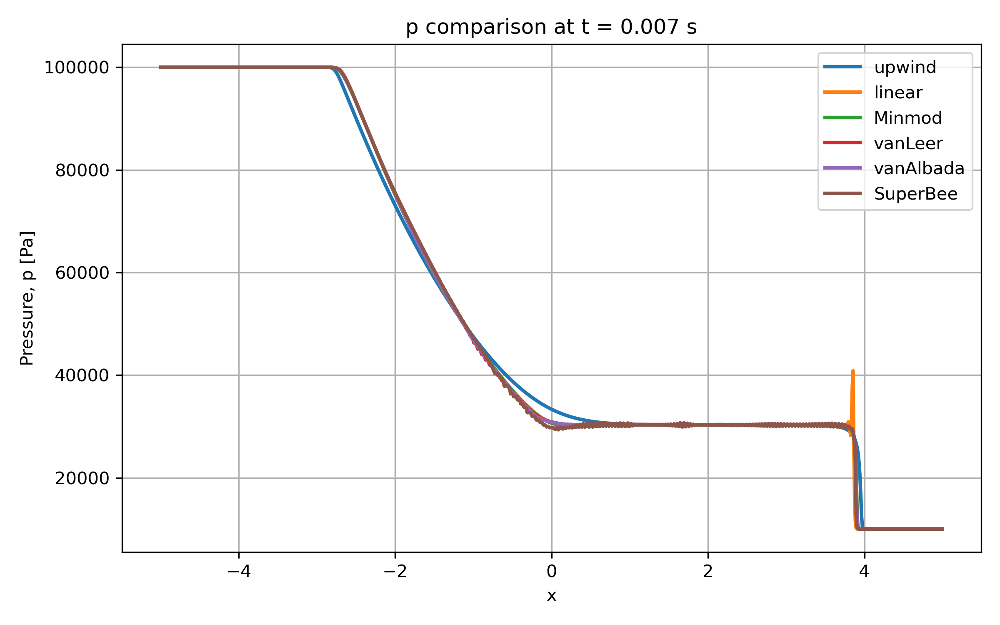
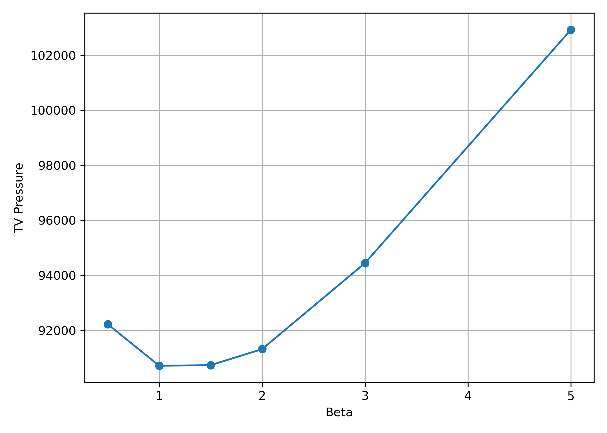
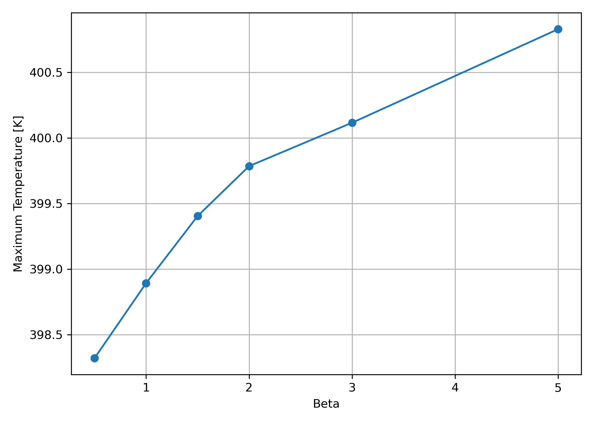

# Development and Evaluation of a Generalized TVD Flux Limiter in OpenFOAM

## Overview

This project investigates how flux limiter formulations influence shock-capturing performance within the OpenFOAM finite-volume framework. Starting from the classical Sod shock tube benchmark, I compared several built-in TVD schemes, traced their implementation into the OpenFOAM source code, developed a custom limiter as a runtime-loadable library, and performed a quantitative parameter study to evaluate its behavior.

The objective was not simply to run OpenFOAM cases, but to gain solver-level understanding of how numerical schemes are implemented, modified, compiled, and verified.

---

## Technical Skills Demonstrated

* OpenFOAM Source Code Exploration
* Finite Volume Methods (FVM)
* TVD Flux Limiters
* Compressible Flow Simulation
* Shock Capturing
* C++ Development
* Shared Library Compilation (`wmake`)
* Numerical Verification & Validation
* Python Automation & Post-Processing

---

## Project Workflow

### 1. Baseline Shock Tube Case

The study began with the standard OpenFOAM Sod shock tube benchmark using the compressible solver framework.

The solution contains:

* Expansion fan
* Contact discontinuity
* Shock wave

Pressure, temperature, and velocity fields were sampled and post-processed for quantitative comparison.

---

### 2. Standard Limiter Comparison

The following limiter schemes were evaluated:

| Scheme    | Characteristics                         |
| --------- | --------------------------------------- |
| Upwind    | Stable but highly diffusive             |
| Linear    | Sharp but oscillatory                   |
| Minmod    | Conservative and bounded                |
| vanAlbada | Balanced shock resolution               |
| vanLeer   | More compressive than vanAlbada         |
| SuperBee  | Sharpest shock but highest oscillations |

The comparison demonstrated the expected tradeoff between numerical diffusion and solution sharpness.



---

### 3. OpenFOAM Source Code Investigation

To understand how numerical schemes are implemented internally, the van Albada limiter was traced from runtime selection in `fvSchemes` into the OpenFOAM source code.

Source path:

```text
fvSchemes
→ Gauss vanAlbada
→ finiteVolume/interpolation/surfaceInterpolation/
  limitedSchemes/vanAlbada
```

This investigation provided direct exposure to OpenFOAM's finite-volume interpolation framework and runtime selection mechanism.

---

### 4. Custom Flux Limiter Development

A custom limiter library named **atharvaLimiter** was developed by modifying the original van Albada formulation.

The limiter was compiled as a shared OpenFOAM library using:

```bash
wmake libso
```

and loaded at runtime through OpenFOAM's dynamic library system.

---

### 5. Generalized Limiter Formulation

The implemented limiter uses a generalized van Albada form:

$$
\phi(r,\beta)=\frac{r(r+\beta)}{r^2+\beta}
$$

where:

* β = 1 recovers the original van Albada limiter
* β < 1 increases diffusion
* β > 1 increases compressiveness

This formulation creates a continuous family of limiters that can be tuned to investigate the tradeoff between numerical diffusion and shock sharpness.

---

### 6. Automated Beta Sweep Study

A Python automation framework was developed to:

1. Modify limiter parameters
2. Recompile the OpenFOAM library
3. Execute simulations
4. Extract quantitative metrics
5. Generate comparison plots

The following values were investigated:

```text
β = 0.5, 1.0, 1.5, 2.0, 3.0, 5.0
```

---

## Results

### Total Variation vs Beta



### Maximum Temperature vs Beta



---

## Quantitative Results

| Beta | TV Pressure | Maximum Temperature [K] | Shock Thickness [cells] |
| ---- | ----------: | ----------------------: | ----------------------: |
| 0.5  |     92224.4 |                 398.320 |                       4 |
| 1.0  |     90715.0 |                 398.892 |                       4 |
| 1.5  |     90736.0 |                 399.404 |                       4 |
| 2.0  |     91318.8 |                 399.785 |                       4 |
| 3.0  |     94447.6 |                 400.116 |                       4 |
| 5.0  |    102926.8 |                 400.830 |                       4 |

---

## Key Findings

* Increasing β reduced numerical diffusion and improved peak-value preservation.
* Larger β values increased total variation, indicating increasingly compressive behavior.
* Shock thickness remained approximately constant at four cells for the mesh resolution considered.
* The study clearly demonstrated the tradeoff between shock sharpness and oscillation control.
* β ≈ 1–1.5 provided the best balance between boundedness and compressiveness for this benchmark.

---

## Repository Structure

```text
analysis/
├── beta_sweep.py
├── compare_schemes.py
├── compute_limiter_metrics.py
└── plot_beta_sweep.py

customSchemes/
└── atharvaLimiter/

cases/
└── schemeComparison/

results/
├── figures/
└── metrics/
```

---

## Takeaway

This project extends beyond standard CFD application workflows into solver-level development. By tracing OpenFOAM source code, implementing a custom TVD limiter, compiling a shared library, and performing an automated parameter study, the project provides hands-on experience with the numerical methods and software infrastructure underlying modern CFD solvers.
