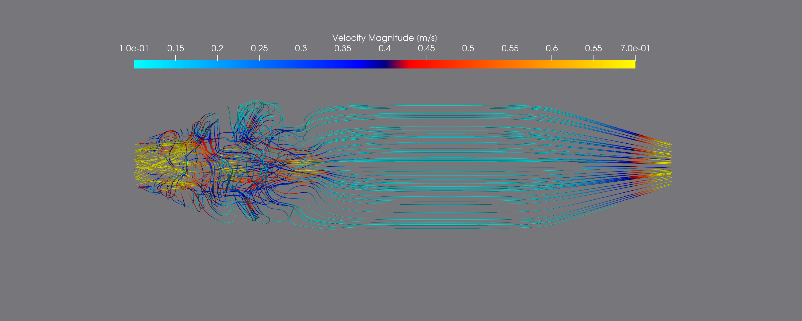
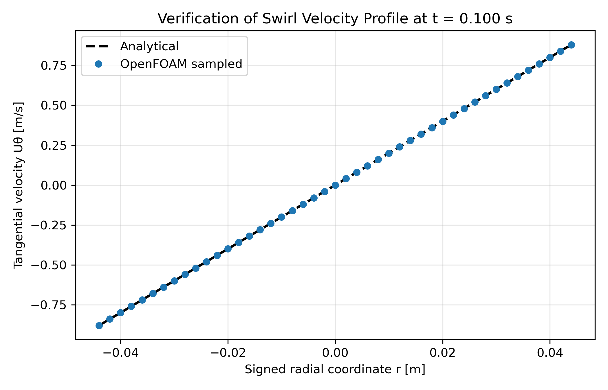
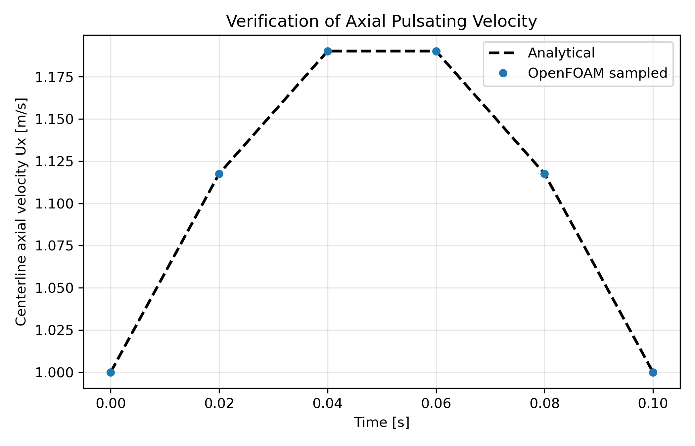
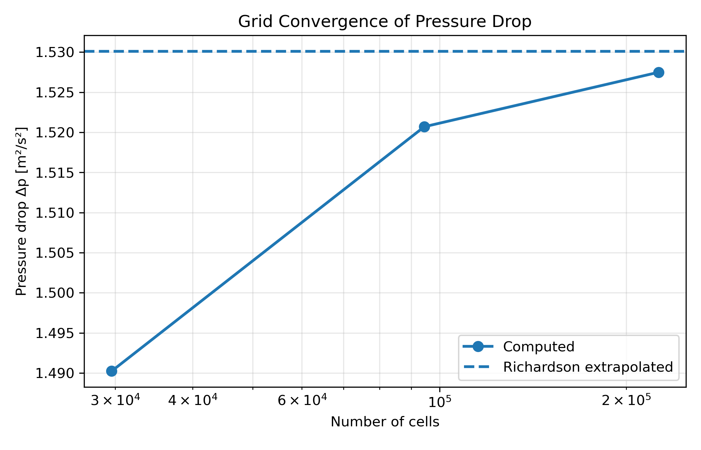
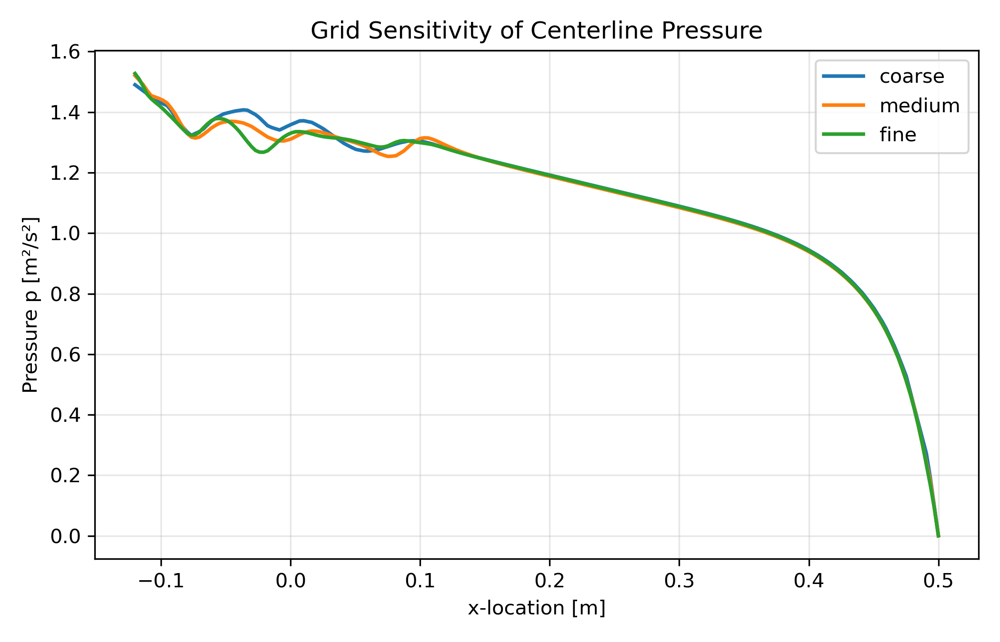
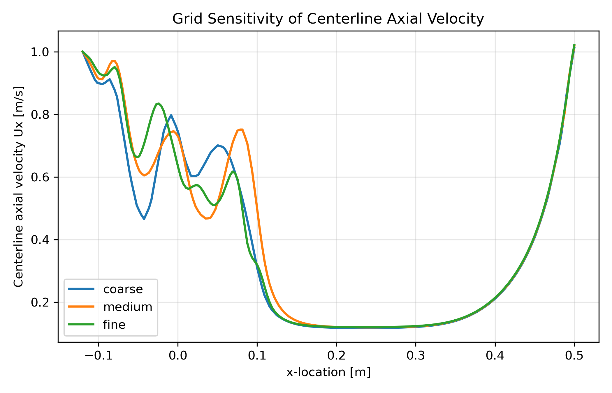
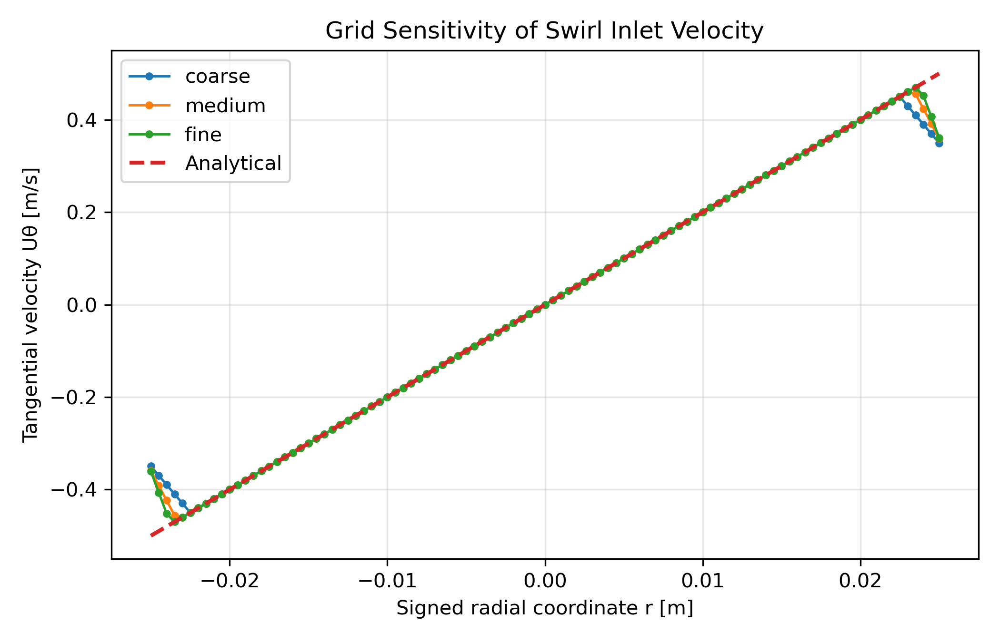
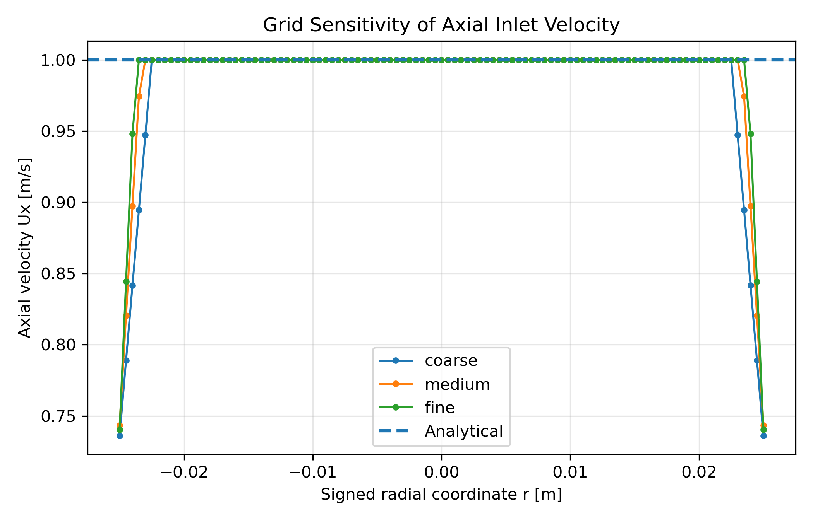

# 06. Custom Transient Swirling Boundary Condition in OpenFOAM

Development and verification of a custom OpenFOAM C++ boundary condition for prescribing transient swirling inflow. The implementation is verified against analytical velocity profiles and further assessed through a three-level grid convergence study using Richardson extrapolation and the Grid Convergence Index (GCI).

---

## Overview

Conventional OpenFOAM boundary conditions are typically configured through dictionaries and are limited to predefined functionality. This project extends OpenFOAM by implementing a custom C++ boundary condition that dynamically computes both axial and tangential velocity components at runtime.

The boundary condition represents swirling inflow conditions commonly encountered in combustors, cyclone separators, swirl injectors, turbomachinery, and rotating flow devices.

To establish numerical credibility, the implementation is verified against the prescribed analytical velocity field and evaluated through a systematic grid convergence study. Rather than relying only on contour plots, quantitative line-profile comparisons are used to assess numerical accuracy and mesh independence.

---

## Project Objectives

- Implement a custom OpenFOAM boundary condition in C++
- Prescribe analytical swirling inlet velocity at runtime
- Verify the boundary condition against analytical velocity profiles
- Perform a three-level grid convergence study
- Quantify numerical uncertainty using Richardson extrapolation and GCI
- Extract centerline and inlet line data for quantitative comparison
- Visualize the resulting confined swirling flow field

---

## Boundary Condition Formulation

The custom boundary condition prescribes a velocity field composed of constant axial flow and a radially varying tangential velocity.

```text
Axial velocity:
Ux = U0

Tangential velocity:
Uθ = Ωr

Velocity vector:
U = Ux ex + Uθ eθ
```

where

- **U0** is the prescribed axial velocity.
- **Ω** is the angular velocity.
- **r** is the radial distance from the inlet center.

During every time step, the custom C++ boundary condition evaluates these analytical expressions, converts the cylindrical velocity components into Cartesian coordinates, and assigns the resulting velocity vector to each inlet face.

---

## Custom Boundary Condition Implementation

The boundary condition is implemented by deriving a new class from OpenFOAM's

```text
fixedValueFvPatchVectorField
```

During each solver iteration, the class performs the following operations:

1. Compute inlet face-center coordinates
2. Calculate radial distance from the inlet center
3. Determine the local tangential direction
4. Evaluate the analytical axial velocity
5. Evaluate the analytical tangential velocity
6. Convert cylindrical velocity components into Cartesian coordinates
7. Apply the resulting velocity vector to the inlet patch

This approach allows the inlet profile to be prescribed through compiled C++ code without modifying the main solver.

---

## Simulation Setup

| Parameter | Value |
|-----------|-------|
| Solver | `pimpleFoam` |
| Flow Model | Incompressible |
| Boundary Condition | Custom C++ velocity boundary condition |
| Mesh Type | Structured hexahedral |
| Time Integration | Transient |
| Pressure-Velocity Coupling | PIMPLE |
| Maximum Courant Number | < 0.8 |
| Post-processing | ParaView + Python |

---

## Key Results

| Metric | Result |
|--------|--------|
| Custom OpenFOAM C++ boundary condition | Implemented |
| Analytical boundary-condition verification | Completed |
| Grid convergence study | Completed |
| Fine mesh size | 225,600 cells |
| Richardson extrapolated pressure drop | 1.5301 |
| Fine-grid GCI | 0.213 % |
| Maximum Courant number | < 0.8 |
| Quantitative line-data extraction | Completed |

---

## Flow Visualization

### Streamlines Colored by Velocity Magnitude



The imposed tangential momentum generates a central recirculation region immediately downstream of the inlet, followed by coherent vortical structures inside the chamber. As the flow progresses downstream, viscous diffusion gradually weakens the swirl while the axial velocity component becomes dominant near the outlet.

This visualization is used as a qualitative demonstration of the flow physics. The main verification of the project is based on analytical comparison and grid convergence data.

---

## Verification Against Analytical Solution

The custom boundary condition was verified by sampling velocity profiles directly from the OpenFOAM solution and comparing them with the prescribed analytical inlet profiles.

### Tangential Velocity Verification



The sampled tangential velocity matches the analytical swirl profile closely, confirming that the custom C++ boundary condition correctly applies the prescribed rotational velocity field.

---

### Axial Velocity Verification



The imposed axial inlet velocity is accurately reproduced throughout the sampled inlet section, demonstrating correct boundary-condition enforcement.

---

## Grid Sensitivity Analysis

Three systematically refined structured meshes were generated to quantify discretization error and assess mesh independence.

| Mesh | Number of Cells |
|------|----------------:|
| Coarse | 29,600 |
| Medium | 94,500 |
| Fine | 225,600 |

The grid sensitivity study evaluates:

- Pressure drop
- Centerline pressure
- Centerline axial velocity
- Inlet velocity-profile accuracy
- Richardson extrapolation
- Grid Convergence Index

---

### Pressure Drop Convergence



The pressure drop converges toward the Richardson-extrapolated solution as the mesh is refined.

---

### Centerline Pressure



The medium and fine meshes produce nearly overlapping pressure distributions across most of the domain, indicating that the pressure field is approaching mesh-independent behavior.

---

### Centerline Axial Velocity



The centerline axial velocity shows stronger mesh sensitivity near the inlet and expansion region, where swirl-induced recirculation is strongest. Downstream, the three mesh solutions collapse toward the same profile.

---

### Swirl Velocity Verification Across Meshes



All three meshes reproduce the analytical swirl profile, with finer meshes reducing interpolation error near the inlet boundaries.

---

### Axial Velocity Verification Across Meshes



The prescribed axial velocity remains consistent across all mesh resolutions, confirming that the imposed inlet condition is not strongly affected by mesh refinement.

---

## Richardson Extrapolation and GCI

Grid convergence metrics were computed using pressure drop as the representative quantity of interest.

| Quantity | Value |
|----------|------:|
| Observed order of accuracy | 4.42 |
| Richardson extrapolated pressure drop | 1.5301 |
| GCI, medium grid | 0.553 % |
| GCI, fine grid | 0.213 % |

The low GCI values indicate that the numerical solution is effectively mesh independent for the selected quantity of interest. The observed order is reported as part of the grid convergence analysis, while the GCI provides the main estimate of numerical uncertainty.

---

## Repository Contents

- **analysis/** — Python scripts for verification, grid sensitivity, Richardson extrapolation, and GCI calculations
- **case/** — OpenFOAM case setup and boundary-condition test case
- **src/** — Custom OpenFOAM boundary condition source code
- **results/data/** — Processed verification and grid convergence metrics
- **results/figures/** — Verification plots, grid sensitivity plots, convergence figures, and visualization outputs

---

## Skills Demonstrated

- OpenFOAM development
- C++ boundary-condition programming
- Finite Volume Method
- CFD verification and validation
- Grid independence analysis
- Richardson extrapolation
- Grid Convergence Index
- Python-based scientific post-processing
- Quantitative line-data extraction
- ParaView visualization
- Numerical accuracy assessment

---

## Future Improvements

Potential extensions of this project include:

- Time-dependent swirl intensity
- Higher-order inlet velocity profiles
- Swirl number evaluation
- RANS/LES sensitivity study
- Compressible swirling flow extension
- Parallel scaling study

---

## Author

**Atharva Gado**  
M.S. Engineering Mechanics  
University of Wisconsin–Madison